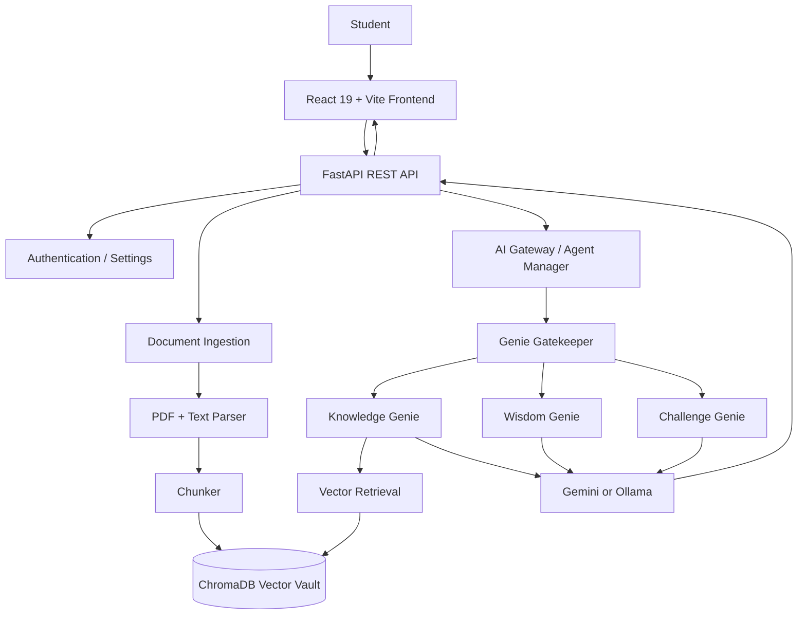
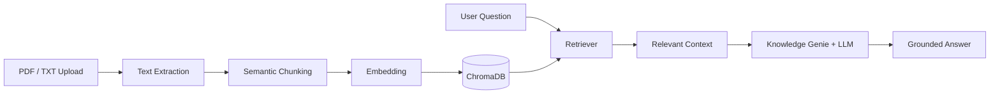

<div align="center">

# 🧞 Contexta AI
### *The Operating System for Personalized Learning*

**Learn Beyond Answers. Powered by Context.**


</div>

---

## ✨ What is Contexta AI?

Contexta AI is a personalized learning workspace that transforms notes, textbooks, lectures, and PDFs into an interactive knowledge system. Instead of returning generic answers, it routes every request to a specialized learning agent grounded in the learner's own material.

### The agent family

| Agent | Responsibility |
|---|---|
| 🪔 **Genie Gatekeeper** | Detects intent and routes the request |
| 📖 **Knowledge Genie** | Answers questions using contextual RAG and citations |
| 📜 **Wisdom Genie** | Creates revision notes, cheat sheets, and flashcards |
| ⚔ **Challenge Genie** | Generates adaptive quizzes and diagnostic feedback |

---

## 🧠 System architecture



## 🔍 Request lifecycle

1. **Capture** — the frontend sends a learner request to the FastAPI API.
2. **Route** — the AI gateway invokes Genie Gatekeeper to classify the intent.
3. **Retrieve when needed** — Knowledge Genie queries the ChromaDB vector vault containing processed learning material.
4. **Generate** — the selected specialist uses Gemini or Ollama with structured prompts.
5. **Respond** — the API returns the answer, study material, or quiz payload to the React interface.

## 📚 Document-to-knowledge pipeline



## 🧩 Repository structure

```text
GenieAI/
├── frontend/          # React, Vite, TypeScript, Tailwind UI
├── backend/           # FastAPI routes and application services
├── ai/
│   ├── agents/        # Gatekeeper, Knowledge, Wisdom, Challenge
│   ├── gateway/       # Agent orchestration and model selection
│   ├── models/        # Gemini and Ollama adapters
│   ├── prompts/       # Prompt templates
│   ├── rag/           # Chunking and vector-store integration
│   └── utils/         # PDF parsing and shared utilities
├── docs/              # Product and setup documentation
├── docker/            # Container configuration
└── tests/             # Validation and integration tests
```

## 🚀 Run locally

### Windows one-click launch

```text
Double-click start.bat
```

This starts the FastAPI backend on `:8000`, the Vite frontend on `:5173`, and opens the application. Use `stop.bat` to stop services.

### Manual setup

```bash
# Frontend
cd frontend
npm install
npm run dev -- --host 0.0.0.0 --port 5173

# Backend
cd backend
pip install -r requirements.txt
uvicorn app.main:app --reload --host 0.0.0.0 --port 8000
```

### Docker

```bash
docker-compose up --build
```

## 🔐 Design principles

- **Grounded generation:** retrieval-first answers for document-based questions.
- **Specialized agents:** one responsibility per learning workflow.
- **Model flexibility:** Gemini and local Ollama adapters.
- **Separation of concerns:** React UI, FastAPI API, AI package, and vector storage remain modular.
- **Privacy-aware learning:** personal study material is processed through the application's configured storage and model stack.

## 📱 Mobile

Contexta supports responsive usage and PWA installation. See [`docs/MOBILE_SETUP.md`](docs/MOBILE_SETUP.md) for smartphone setup.

---

<div align="center">

**Contexta © 2026 · Powered by Contexta AI**

</div>
